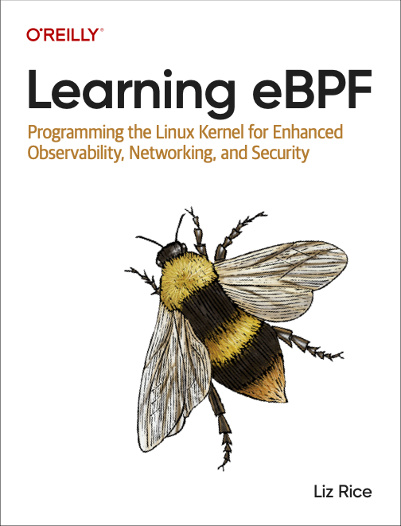

# Learing-eBPF-Exercises

记录阅读《Learning-eBPF》书中每章Exercises部分课后题答案，自己编写的内容，仅供参考。

## About 《Learing-eBPF》

> 引用自：https://github.com/lizrice/learning-ebpf

This new book [Learning eBPF](https://www.amazon.com/Learning-eBPF-Programming-Observability-Networking/dp/1098135121) wrote by [Liz Rice](https://github.com/lizrice) (published by O'Reilly).

Buy your copy of the book from
[Bookshop.org](https://bookshop.org/p/books/learning-ebpf-programming-the-linux-kernel-for-enhanced-observability-networking-and-security-liz-rice/19244244?ean=9781098135126)
or
[Amazon](https://www.amazon.com/Learning-eBPF-Programming-Observability-Networking/dp/1098135121),
view it on the [O'Reilly platform](https://www.oreilly.com/library/view/learning-ebpf/9781098135119/), or download a copy from [Isovalent](https://isovalent.com/learning-ebpf). 

## Exercises

- [chapter2](./chapter2/README.md)
